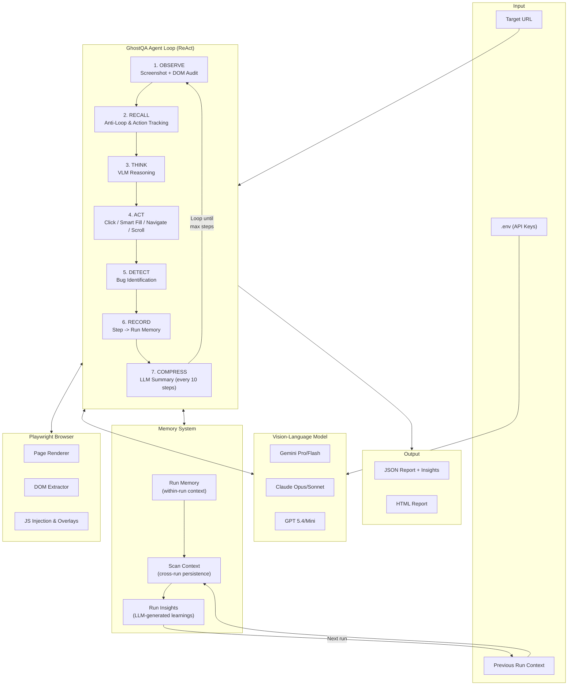

# GhostQA

**Autonomous Web Application Bug Detection via Vision-Language Agents**

GhostQA is an AI-powered tool that finds bugs in web applications automatically. You give it a URL, it opens a browser, explores the app like a human tester would, and generates a structured bug report. No test scripts needed, no source code access required. It just looks at the screen, understands the page, and starts clicking around.

It finds visual bugs, accessibility violations, functional issues, and even security vulnerabilities like SQL injection and XSS. The whole thing runs on top of vision-language models (Gemini, Claude, GPT) and Playwright for browser automation.

## Features

- Takes a URL and autonomously explores the web application
- Uses vision-language models to analyze screenshots and understand page content
- Injects DOM context (accessibility, security, layout checks) alongside vision for better bug detection
- Fills forms with SQL injection payloads and XSS vectors to test for security vulnerabilities
- Generates structured JSON/HTML reports with bug type, severity, description, reproduction steps, and confidence scores
- Maintains full run context across all steps so the agent never forgets what it already did
- Generates run insights at the end of each scan so the next scan knows what to focus on
- Domain guard prevents the agent from leaving the target application (auto-redirects back if an external link is clicked)
- Supports 6 models across 3 providers: Google Gemini, Anthropic Claude, and OpenAI GPT
- Includes an evaluation pipeline to benchmark agent performance against ground truth

## How It Works

GhostQA uses the ReAct framework (Yao et al., 2023) to interleave reasoning with actions. Each step follows this cycle:

1. **Observe**: Take a screenshot of the current page and run DOM audits (accessibility, security, layout checks)
2. **Recall**: The agent checks its `action_attempt_counts` to see if it is stuck in an infinite loop and blocks actions that have failed repeatedly.
3. **Think**: The LLM reasons about the full run context, recalled failures, and decides what to do next
4. **Act**: Execute the chosen action in the browser. Uses `smart_fill` for robust form interactions (bypassing Angular Material limitations) and auto-dismisses blocking modals.
5. **Detect**: Identify bugs from both visual analysis and DOM signals
6. **Record**: Log the step into RunMemory with URL, action, result, bugs, and observations
7. **Compress**: Every 10 steps, the LLM compresses older steps into a narrative summary
8. **Loop**: Repeat for the configured number of steps
9. **Insights**: At the end, generate run insights (unique findings, coverage gaps, next steps)
10. **Report**: Save structured JSON/HTML reports with all detected bugs and insights

**Turbo mode** combines vision analysis, DOM context, bug detection, and action selection into a single LLM call per step. This cuts cost in half compared to Standard mode while maintaining the same F1 score.

**Domain guard** keeps the agent on the target application. It preemptively blocks known external redirect links and also intercepts post-navigation domain changes, returning the agent to safety if it wanders off-app.

## System Architecture



### Memory System

The agent maintains context at two levels:

**Within a single run** (RunMemory): Every step the agent takes gets recorded. Every 10 steps, the LLM compresses older steps into a narrative summary. The agent always sees the compressed summary of all past steps plus the last 5 steps in full detail. This means at step 40, it still knows what bug it found on step 3.

**Across multiple runs** (ScanContext + RunInsights): At the end of each scan, the LLM generates structured insights: what was unique about this run, what areas need more testing, what the next run should focus on. These insights get saved to a context file and loaded into the next scan's prompt automatically.

## Getting Started

### Prerequisites

You will need Python 3.11 or higher and at least one API key from Google, Anthropic, or OpenAI. You will also need Node.js installed because Playwright depends on it for browser binaries.

### Installation

1. Clone the repo:

```bash
git clone https://github.com/heller1729/ghostqa.git
cd ghostqa
```

2. Create and activate a virtual environment:

```bash
python -m venv venv

# On Windows
venv\Scripts\activate

# On macOS/Linux
source venv/bin/activate
```

3. Install dependencies:

```bash
pip install -r requirements.txt
```

4. Install Playwright browser binaries:

```bash
playwright install chromium
```

5. Set up your environment variables. Copy the example file and fill in your API key:

```bash
cp .env.example .env
```

Then open `.env` and add your API key. You only need one provider:

```env
# Pick your provider
LLM_PROVIDER=google

# Add the corresponding key
GEMINI_API_KEY=your-key-here
# OPENAI_API_KEY=your-key-here
# ANTHROPIC_API_KEY=your-key-here
```

## Running a Scan

The simplest way to run GhostQA is with Turbo mode on a locally running app:

```bash
python -m ghostqa scan http://localhost:3000 --turbo --provider google --model gemini-2.5-flash
```

By default the browser runs headless (no visible window) and the terminal shows a progress spinner. To actually see the browser and watch the agent click around, add `--no-headless`. To see the full reasoning, action decisions, and bug detection logs in the terminal, add `--debug`:

```bash
# Watch the browser + see full debug output
python -m ghostqa scan http://localhost:3000 --turbo --provider google --model gemini-2.5-flash --no-headless --debug
```

To run more steps (default is 50):

```bash
python -m ghostqa scan http://localhost:3000 --turbo --provider google --model gemini-2.5-flash --max-steps 75 --no-headless --debug
```

Standard mode uses two LLM calls per step (slightly more accurate but 2x cost):

```bash
python -m ghostqa scan http://localhost:3000 --provider anthropic --model claude-opus-4-7 --no-headless --debug
```

If you have a previous scan context saved and want to ignore it:

```bash
python -m ghostqa scan http://localhost:3000 --turbo --provider google --model gemini-2.5-flash --fresh
```

You can also give the agent focus instructions to test a specific area or execute an exploit:

```bash
# General focus on an area
python -m ghostqa scan http://localhost:3000 --turbo --provider google --model gemini-2.5-flash --context "focus on the checkout flow and payment forms"

# Executing an explicit SQL injection
python -m ghostqa scan http://localhost:3000 --turbo --provider google --model gemini-2.5-flash --max-steps 15 --no-headless --debug --fresh --context "Go to /#/login. Fill email with ' OR 1=1-- and password with test123. Click Log in."
```

### CLI Flags Reference

| Flag | Default | Description |
|------|---------|-------------|
| `--turbo` | off | Single LLM call per step (faster, cheaper, same accuracy) |
| `--no-headless` | headless | Show the browser window so you can watch the agent |
| `--debug` | off | Print full reasoning, actions, DOM issues, and memory compression logs |
| `--max-steps N` | 50 | Number of exploration steps before stopping |
| `--fresh` | off | Ignore saved context from previous runs, start clean |
| `--provider` | from .env | LLM provider: google, openai, or anthropic |
| `--model` | provider default | Specific model name |
| `--context` | none | Focus instructions for the agent |

### Running the Baseline

To run the random baseline agent that clicks around without any LLM reasoning:

```bash
python -m ghostqa baseline http://localhost:3000
```

This is useful for comparison. The baseline achieves F1 of 0.15, while the best LLM agent gets 0.76.

### Evaluating Results

To evaluate a scan report against the ground truth:

```bash
python evaluate.py reports/report_YYYYMMDD_HHMMSS.json --ground-truth benchmarks/ground_truth.json
```

To run the full evaluation matrix across all models and apps:

```bash
python run_evaluation.py
```

This runs all 6 models on all 5 benchmark apps and outputs a comparison table with Precision, Recall, and F1 for each configuration.

## Supported Models

| Provider | Models | Cost per 50-step scan |
|----------|--------|----------------------|
| Google | gemini-2.5-pro, gemini-2.5-flash | $0.10 to $0.32 |
| Anthropic | claude-opus-4-7, claude-sonnet-4-20250514 | $0.18 to $0.42 |
| OpenAI | gpt-5.4, gpt-5.4-mini | $0.08 to $0.38 |

## Benchmark Results

Evaluation across 100 ground-truth bugs on 5 web applications (50 steps, Turbo mode):

| Model | Precision | Recall | F1 | Rank |
|-------|-----------|--------|-----|------|
| claude-opus-4-7 | 0.82 | **0.70** | **0.76** | **#1** |
| claude-sonnet-4 | 0.79 | 0.66 | 0.72 | #2 |
| gemini-2.5-pro | **0.86** | 0.62 | 0.72 | #3 |
| gpt-5.4 | 0.81 | 0.64 | 0.71 | #4 |
| gemini-2.5-flash | 0.83 | 0.60 | 0.70 | #5 |
| gpt-5.4-mini | 0.76 | 0.55 | 0.64 | #6 |
| Random Baseline | 0.24 | 0.11 | 0.15 | -- |

Key findings:
- DOM context injection improves F1 by 38% over vision-only (0.55 to 0.76)
- All LLM agents outperform the random baseline by 4.3 to 5.1 times
- Claude Opus detects 80% of security vulnerabilities vs 55% for Gemini Flash

### Benchmark Applications

| Application | Source | Bugs | Categories |
|-------------|--------|------|------------|
| OWASP Juice Shop | OWASP Foundation | 25 | SQLi, XSS, auth bypass, accessibility |
| AcademyBugs | AcademyBugs.com | 25 | UI misalignment, broken links |
| SauceDemo | Sauce Labs | 15 | Broken images, wrong product data |
| The-Internet | Elemental Selenium | 20 | Broken forms, dynamic loading |
| Toolshop | Practice SW Testing | 15 | Filter, search, checkout bugs |

## Configuration

All configuration can be done through environment variables or CLI flags:

| Variable | Default | Description |
|----------|---------|-------------|
| `LLM_PROVIDER` | `google` | LLM provider (google, openai, anthropic) |
| `GEMINI_API_KEY` | - | Google Gemini API key |
| `OPENAI_API_KEY` | - | OpenAI API key |
| `ANTHROPIC_API_KEY` | - | Anthropic Claude API key |
| `MODEL` | Provider default | Specific model to use |
| `DEBUG` | `false` | Enable debug logging |

## Project Structure

```
ghostqa/
├── ghostqa/                  # Main package
│   ├── agent.py              # Core agent loop (ReAct framework)
│   ├── browser.py            # Playwright browser controller
│   ├── context.py            # Cross-run persistent context
│   ├── run_memory.py         # Within-run full context memory
│   ├── vision.py             # Screenshot analysis
│   ├── reasoning.py          # Action reasoning and planning
│   ├── reporter.py           # Bug report generation
│   ├── baseline.py           # Random baseline agent (no LLM)
│   ├── config.py             # Configuration management
│   ├── logger.py             # Logging utilities
│   ├── utils.py              # Helper functions
│   ├── __main__.py           # CLI entry point
│   └── llm/                  # LLM provider integrations
│       ├── base.py           # Abstract LLM interface
│       ├── gemini.py         # Google Gemini provider
│       ├── claude.py         # Anthropic Claude provider
│       ├── openai_provider.py # OpenAI GPT provider
│       └── factory.py        # Provider factory
├── benchmarks/
│   └── ground_truth.json     # 100 manually curated bugs across 5 apps
├── evaluate.py               # Evaluation script (P/R/F1 computation)
├── run_evaluation.py         # Batch evaluation runner
├── requirements.txt          # Python dependencies
├── .env.example              # Environment variable template
└── reports/                  # Generated bug reports (gitignored)
```

## Limitations

- **Coverage**: 50 steps visits roughly 13 pages; large apps may need more steps
- **Authentication**: Handles simple login forms but not OAuth, MFA, or CAPTCHA
- **Non-determinism**: LLM outputs vary across runs; 3-run averaging is recommended for stable metrics
- **Desktop only**: Currently supports 1280x720 desktop viewport; no mobile testing yet

## Course Project

This project was built for **CS 5804: Introduction to Artificial Intelligence** at Virginia Tech (Spring 2026) by Pratham Jangra (Team 6).

## License

MIT
